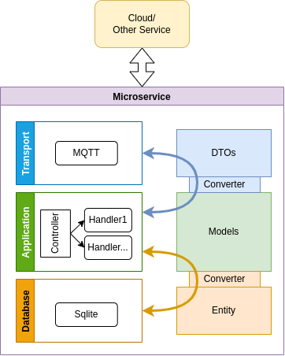
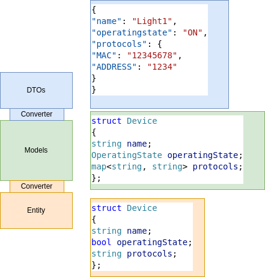

- [1. Tổng quan](#1-tổng-quan)
- [2. Kiến trúc triển khai Microsevrice](#2-kiến-trúc-triển-khai-microsevrice)
- [3. Ví dụ triển khai Microservice](#3-ví-dụ-triển-khai-microservice)
  - [3.1. File cấu hình](#31-file-cấu-hình)
  - [3.2. Triển khai lớp Application](#32-triển-khai-lớp-application)
  - [3.3. Triển khai hàm main()](#33-triển-khai-hàm-main)


# 1. Tổng quan
Smart Agriculture Gateway: Định nghĩa các Model, DTO, interface sử dụng bởi các service

Một số thư mục:
- `models`: định nghĩa các model, được sử dụng trong xử lý logic
- `dtos`: định nghĩa dtos và các hàm chuyển đổi từ/tới model, được sử dụng để giao tiếp giữa các service hoặc server
- `common`: định nghĩa các hằng số toàn cục, hàm hỗ trợ cơ bản
- `database`: triển khai lớp database
- `transports`: triển khai lớp transport cho việc trao đổi dữ liệu giữa các service hoặc server
- `clients`: thư viện để  service gửi các yêu cầu tới các service khác
- `servers`: thư viện để service gửi phản hồi tới các client
- `controller`: ý tưởng như một REST API server: điều phối gói tin, cho phép service đăng ký các hàm callback ứng với lệnh nào đó.

# 2. Kiến trúc triển khai Microsevrice





# 3. Ví dụ triển khai Microservice

## 3.1. File cấu hình

```json
{
    "database": {
        "type": "sqlite",
        "params": {
            "filename": "db.sqlite"
        }
    },
    "transport": {
        "type": "mqtt",
        "params": {
            "id": "1234",
            "host": "localhost",
            "port": "1883",
            "maxqueue": "100"
        }
    },
    "server-transport": {
        "type": "mqtt",
        "params": {
            "id": "4321",
            "host": "localhost",
            "port": "1883",
            "maxqueue": "100"
        }
    }
}
```

## 3.2. Triển khai lớp Application

```C++
/*
    Lớp Application:
    - Xử lý logic của service
    - Triển khai các API callback
*/
class MyService
{
public:
    /*
        Ví dụ 1 API callback: 
        - Xử lý yêu cầu thêm readings
    */
    static void addReadingHandler(string message)
    {
        // B1: Chuyển đổi dữ liệu: json -> model
        dto::AddReadingsRequest req;
        deserialize<dto::AddReadingsRequest>(message, req);
        std::vector<model::Reading> readings = dto::toModel(req.readings);

        // B2: Xử lý logic:
        // Ví dụ ở đây là truy vấn Database
        string err;
        Db::getDb()->addReading(readings, err);
        if (err != "")
        {
            cout << err << endl;
        }

        // B3: Logic khác:
        // Thông thường B3 sẽ là phản hồi như sau:
        /*
        string err1;
        err1 = server.response("toTopic", rqi, err);
        if (err1 != "")
        {
            cout << err1 << endl;
        }
        */

        // Tuy nhiên, theo logic của hàm này, nó sẽ gửi readings tới các service khác
        Coredata server("coredata");

        string rqi = "1234";
        err = server.publishMultiDevice("rd/coredata/telemetry", rqi, readings);
        if (err != "")
        {
            cout << err << endl;
        }
    }
};
```

## 3.3. Triển khai hàm main()

```C++
int main()
{
    /*
        Khởi tạo các lớp cần dùng
    */
    Db::init("config.json");
    Transports::init("config.json");

    /*
        Khởi tạo Controller và đăng ký API
    */
    RequestController requester;
    requester.init("rd/myservice/request");
    requester.registerCallback(OP_READINGS_ADD, bind(&MyService::addReadingHandler, placeholders::_1));

    /*
        Chạy Controller ở chế độ detach
    */
    requester.server(true);

    /* 
        Xử lý các logic khác
    */
    while (true)
    {
        // do something
    }

    return 0;
}
```

Chi tiết: [coredata example](https://github.com/R-ng-Dong/ag-core-contracts/blob/main/coredata_draf.cpp)